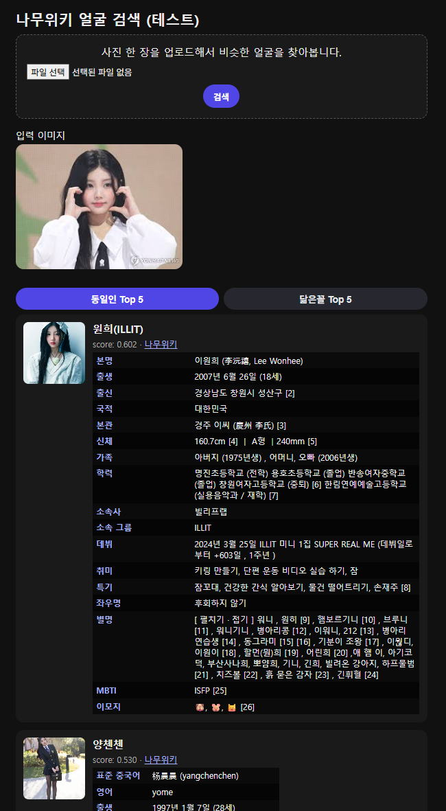

# NamuWiki Face Recognition & Look-Alike Search

한국 인물 데이터(나무위키)를 기반으로 얼굴 임베딩을 생성하고,  
동일인 식별(InsightFace) + 닮은꼴 추천(PCA 기반 Similarity Embedding)을 제공하는  
로컬 검색 시스템.

## 📂 프로젝트 구조
```
FACE_RECOGNITION/
 ├── crawls/                         # 나무위키 → 인물 DB + 이미지 크롤링
 │     ├── namu_discover_tree.py
 │     ├── namu_filter_person_candidates.py
 │     ├── namu_parse_persons.py
 │     ├── namu_wiki_pages.sqlite
 │     └── namu_wiki_persons.sqlite
 │
 ├── data/                           # 결과 데이터 / DB / FAISS / PCA 파라미터
 │     ├── namu_wiki_facevec.sqlite
 │     ├── namu_facevec_ip.faiss
 │     ├── namu_facevec_sim_ip.faiss
 │     └── namu_face_pca_params.npz
 │
 ├── embeddings/
 │     ├── namu_face_embed.py        # 이미지 → InsightFace → 512D face_vec 생성
 │     ├── namu_build_faiss_index.py # 동일인 검색용 FAISS (L2 normalized IP)
 │     └── namu_build_face_sim_pca.py# PCA 기반 face_sim_vec 생성 + sim FAISS
 │
 ├── images/                         # 크롤링한 이미지 (Git ignored)
 │
 ├── app.py                          # Flask UI (모바일 대응)
 └── README.md
```

## 🧭 전체 작업 흐름 및 기술 설명

아래는 이 프로젝트가 작동하게 된 전체 파이프라인입니다.

---

## 1️⃣ Crawls – 나무위키 → 원천 데이터 생성

### ✔ 목표
- 나무위키 인물 문서를 자동 탐색  
- 인물 정보, infobox, 이미지 URL 수집  
- SQLite DB(namu_wiki_persons.sqlite)에 저장  

### ✔ 주요 알고리즘 / 과정

| 스크립트 | 역할 | 주요 아이디어 |
|---------|------|----------------|
| namu_discover_tree.py | 상위 카테고리에서 모든 인물 페이지 재귀 수집 | DFS 탐색, 하위분류만 따라가기 |
| namu_filter_person_candidates.py | 사람만 남기기 | page_title 정규식 기반 필터링 |
| namu_parse_persons.py | 실제 문서 파싱, infobox + 이미지 저장 | HTML 파싱 + JSON 인코딩 |

### ✔ 이유
- 나무위키 API가 없어서 HTML 기반 크롤링이 필요  
- 정보 구조가 제각각이기 때문에 카테고리 기반 필터링 + 직접 파싱이 가장 안정적  

---

## 2️⃣ Images – 모든 사람 이미지 다운로드

- 크롤링한 이미지 URL을 기반으로  
  `images/namu_wiki/*.webp` 형태로 로컬에 **15만장 다운로드**
- 일부 페이지는 대표 이미지가 없음 → missing 처리  
- 같은 사람 여러 이미지 → 가장 큰 규격 1장만 사용  

---

## 3️⃣ Embeddings – 얼굴 임베딩 생성

### ✔ 스크립트: `embeddings/namu_face_embed.py`

### ✔ 알고리즘
- InsightFace **buffalo_l** 모델 (ResNet‑100, 512D)
- GPU 기반 병렬 처리
- face detection → alignment → 512D embedding  
- 결과는 SQLite DB `face_vec` 컬럼 저장

### ✔ InsightFace 선택 이유
- SOTA 모델 + 한국인 얼굴에서도 안정적인 성능  
- DeepFace/CLIP 대비 동일인 식별 정확도 매우 높음  

---

## 4️⃣ FAISS Index – 동일인 검색

### ✔ 스크립트: `embeddings/namu_build_faiss_index.py`

### ✔ 알고리즘
- 512D face_vec → L2 normalize → Inner Product(IP)
- `IndexFlatIP + IndexIDMap2`
- 저장: `data/namu_facevec_ip.faiss`

### ✔ 왜 Inner Product(IP)?
- L2-normalized 벡터에서  
  **cosine similarity == inner product**
- FAISS에서 가장 빠르고 안정적

---

## 5️⃣ Look-Alike Search – 닮은꼴 추천

### 문제
InsightFace embedding은 동일인 구분에 최적화되어 있어,  
**“본인”외의 닮은꼴은 의도적으로 먼 벡터로 밀어냄**

### ✔ 해결: PCA 기반 embedding 변환

### ✔ 스크립트: `embeddings/namu_build_face_sim_pca.py`

### ✔ 알고리즘
1. 모든 512D face_vec 로딩
2. PCA 적용  
3. `sim_vec = PCA(face_vec - mean)` → **128D**
4. L2 normalize  
5. SQLite `face_sim_vec` 저장  
6. FAISS sim index 저장: `namu_facevec_sim_ip.faiss`

### ✔ 왜 PCA가 닮은꼴에 적합한가?
- InsightFace embedding 구성:
  - 초반 축: 동일인 식별 능력이 강함
  - 후반 축: 톤/성별/나이/스타일/표정 등 “닮은” 특징
- PCA로 embedding을 압축하면  
  **동일인은 멀어지고, 닮은 특징은 가까워짐**

---

## 6️⃣ app.py – 로컬 Flask UI

### ✔ 기능
- 모바일 대응 UI  
- 이미지 업로드 → face detect → embedding  
- 동일인 Top 5  
- 닮은꼴 Top 5  
- 버튼으로 전환  
- 카드를 통해 나무위키 정보 & 이미지 표시  



---

## 📌 기술 선택 요약

| 기술 | 이유 |
|------|------|
| InsightFace | 동일인 식별 정확도 최고 |
| PCA | 닮은 특징만 구조적으로 추출 |
| FAISS | 8만 벡터도 1ms 검색 |
| SQLite | 가볍고 빠름 |
| Flask | 단일 파일 UI 구축 용이 |

---

## 📄 라이선스 & 주의사항
- 나무위키 데이터: **CC‑BY‑NC‑SA 2.0 KR**
- 이미지 데이터는 문서의 라이선스 따름  
- 본 프로젝트는 **연구·개발용**으로만 사용
